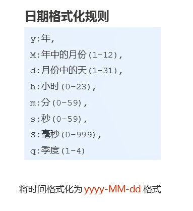

# 计算属性、侦听器与过滤器小课堂

## 计算属性computed
+ 说明：模板中的表达式，计算逻辑比较复杂时，使用**计算属性**能让模板更简洁
  - 需要将字符串'Hello'反转**[demo]**
  - Hello -> ['H', 'e', 'l', 'l', 'o'] -> ['o', 'l', 'l', 'e', 'H'] -> olleH
  - `<p>{{msg.split('').reverse().join('')}}</p>`
  - 使用计算属性，模板写作`<p>{{reverseMsg}}</p>`
+ 语法：添加computed参数
```javascript
    new Vue({
      el: '#app',
      data: {
        msg: 'Hello'
      },
      computed : {
        reverseMsg : function(){
          return this.msg.split('').reverse().join('');
        }
      }
    })
```
+ 典型用法：
  1. 默认只有`getter`的计算属性：**[demo]**
  ```html
    <script>
      // 创建 Vue 实例，得到 ViewModel
      var vm = new Vue({
        el: '#app',
        data: {
          firstName: 'jack',
          lastName: 'chen'
        },
        methods: {},
        computed: { // 计算属性； 特点：当计算属性中所以来的任何一个 data 属性改变之后，都会重新触发 本计算属性 的重新计算，从而更新 fullName 的值
          fullName() {
            return this.firstName + ' ' + this.lastName;
          }
        }
      });
    </script>
  ```
  2. 定义有`getter`和`setter`的计算属性：
  ```JavaScript
        computed: {
          fullName: {
            get: function () {
              return this.firstName + ' ' + this.lastName;
            },
            set: function (newVal) {
              var parts = newVal.split(' ');
              this.firstName = parts[0];
              this.lastName = parts[1];
            }
          }
        }
  ```
+ 注意：
    - 使用的时候直接写上计算属性的函数名即可，就当普通属性一样用
    - 计算属性中引用的data中的数据发生变化时，计算属性会跟着变化
    - 计算属性默认只有 getter，不过在需要时你也可以提供一个 setter
+ computed和methods的对比 **[demo]**
    - computed是基于依赖数据进行缓存的
        * 依赖数据不变则使用缓存数据，变化时重新计算
    - methods不缓存
        * 每次调用都会执行函数计算
    - 计算属性的缓存机制在计算比较耗时的计算的时候就能节省性能


## 侦听器watch
+ 说明：当data数据变化时，会触发侦听器绑定的方法，应用在异步或执行开销较大的操作上
+ 语法：
```javascript
watch : {
    name : function(newVal, oldVal){ // 变化后，变化前数据
        //执行某方法
    }
}
```
+ 注意：
    - watch监听的是在data中**已有的数据**，所以方法名必须和data属性一致
    - computed则是新的计算属性，方法名需重新定义
+ 典型用法：
  1. 监听`data`中属性的改变 **[demo]**
  ```html
    <script>
      // 创建 Vue 实例，得到 ViewModel
      var vm = new Vue({
        el: '#app',
        data: {
          firstName: 'jack',
          lastName: 'chen',
          fullName: 'jack chen'
        },
        methods: {},
        watch: {
          'firstName': function (newVal, oldVal) { // 第一个参数是新数据，第二个参数是旧数据
            this.fullName = newVal + ' ' + this.lastName;
          },
          'lastName': function (newVal, oldVal) {
            this.fullName = this.firstName + ' - ' + newVal;
          }
        }
      });
    </script>
  ```
  2. 监听路由对象route的改变 **[demo]**
  ```html
    <script>
      var login = Vue.extend({
        template: '<h1>登录组件</h1>'
      });

      var register = Vue.extend({
        template: '<h1>注册组件</h1>'
      });

      var router = new VueRouter({
        routes: [
          { path: "/login", component: login },
          { path: "/register", component: register }
        ]
      });

      // 创建 Vue 实例，得到 ViewModel
      var vm = new Vue({
        el: '#app',
        data: {},
        methods: {},
        router: router,
        watch: {
          '$route': function (newVal, oldVal) {
            if (newVal.path === '/login') {
              console.log('这是登录组件');
            }
          }
        }
      });
    </script>
  ```
  3. 监听时执行异步操作或开销大的操作 **[demo]**
    - [异步请求和中间状态的好栗子](https://cn.vuejs.org/v2/guide/computed.html#%E4%BE%A6%E5%90%AC%E5%99%A8)
 
  4. 监听一个对象中的属性 **[demo]**
    - 对监听的数据配置一个handler函数，按需设置deep属性
    - 深度监听：deep设为了true，如果修改了对象任何一个属性，都会执行handler这个方法
    - newVal, oldVal参数值相同都为新值
    - 开销较大
  ```javascript
    watch: {
      queryData: {
          handler: function(newVal, oldVal) {
              //do something
          },
          deep: true
      }
    }
  ```

## 过滤器filter
+ 概念：Vue.js 允许自定义过滤器，**可被用作一些常见的文本格式化**。过滤器可以用在两个地方：**插值表达式和v-bind表达式**。过滤器应该被添加在表达式的尾部，由“管道”符`|`指示；
+ 作用：格式化数据，比如将字符串处理为首字母大写，日期字符串处理为指定格式
+ 语法： **[demo]**
```javascript
    //使用: 插值表达式、属性绑定的值
    <div>{{date | dateFormat | upper}}</div>
    <div v-bind:id="id | idFilter"></div> 
    
    // 全局过滤器
    Vue.filter('dateFormat', function(value){ //value是被过滤的原数据
        // 过滤器逻辑，返回最终的结果
        return ...
    });
    

    //组件私有过滤器
    filters : {
        upper : function(val){
            return val[0].toUpperCase() + val.slice(1);
        }
    }
```
+ 带参数的过滤器 **[demo]**
    - 参数传递 `date | format(arg)`
    - 第一个参数始终是被过滤的元数据
    - 参数是从第二个开始的
    - 案例：
    ```html
    <div>{{date | format('yyyy-MM-dd hh:mm')}}</div>
    <script>
    Vue.filter('format', function(value, arg){ 
        function dateFormat(value, fmt) {
            var date = new Date(value);
            var o = {
                    "M+": date.getMonth() + 1, //月份
                    "d+": date.getDate(), //日
                    "h+": date.getHours(), //小时
                    "m+": date.getMinutes(), //分
                    "s+": date.getSeconds(), //秒
                    "q+": Math.floor((date.getMonth() + 3) / 3), //季度
                    "S": date.getMilliseconds() //毫秒
            };
            if (/(y+)/.test(fmt))
                fmt = fmt.replace(RegExp.$1, (date.getFullYear() + "").substr(4 - RegExp.$1.length));
            for (var k in o)
                if (new RegExp("(" + k + ")").test(fmt))
                    fmt = fmt.replace(RegExp.$1, (RegExp.$1.length == 1) ? (o[k]) : (("00" + o[k]).substr(("" + o[k]).length)));
            return fmt;
        }
        return dateFormat(value, arg);
    });
    </script>
    ```
    

## `watch`、`computed`和`methods`之间的对比
1. `computed`属性的结果会被缓存，除非依赖的data数据变化才会重新计算。主要当作属性来使用，需要return一个值
2. `methods`方法表示一个具体的操作，主要书写业务逻辑
3. `watch`主要用来监听某些特定数据的变化，主要用来执行一些异步操作或者开销大的操作
